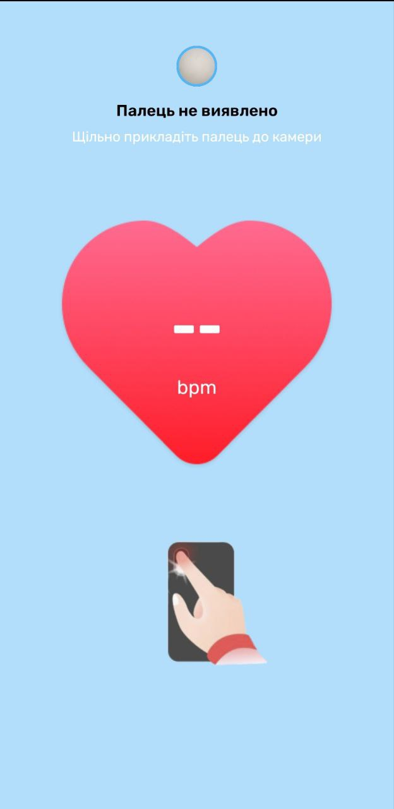
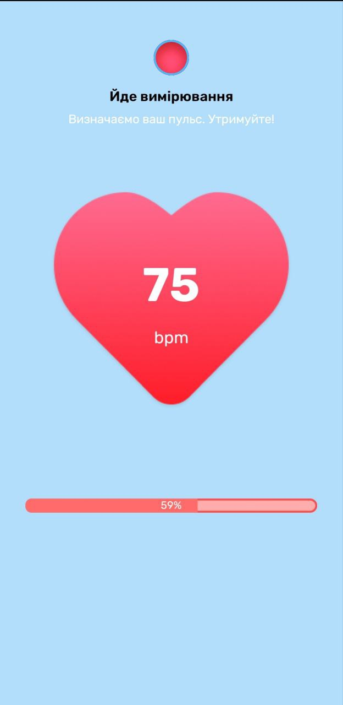
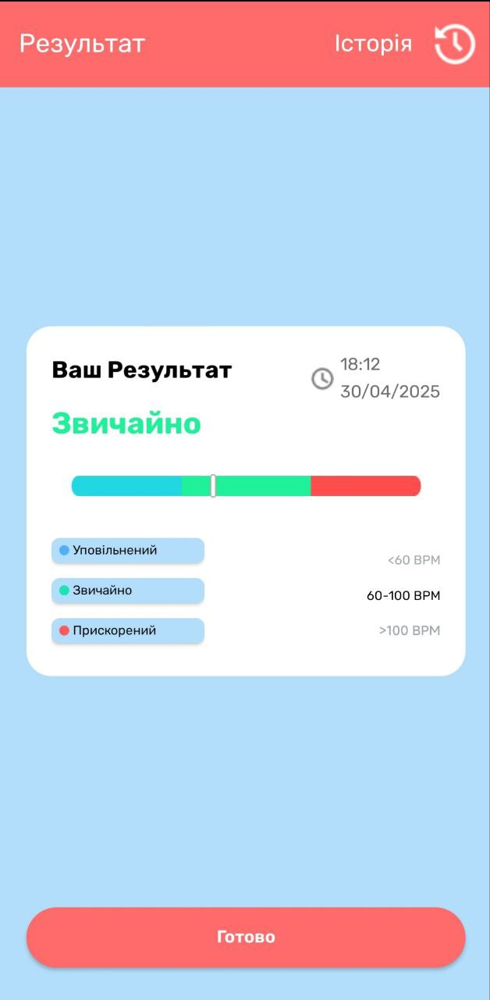
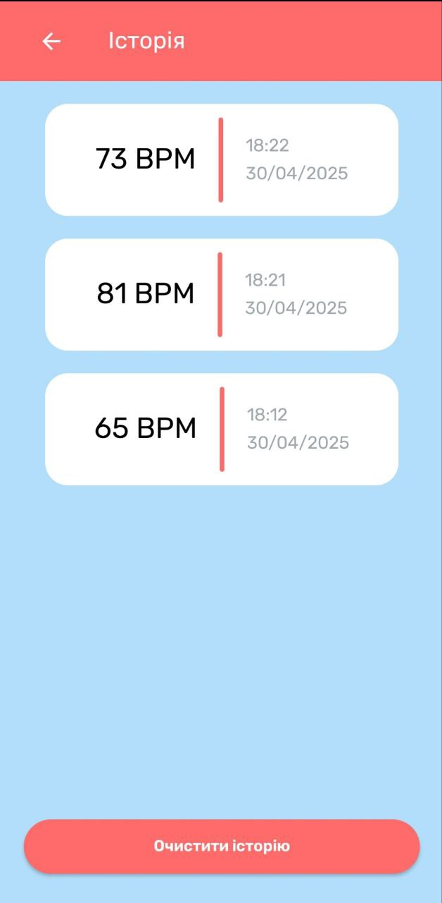

# HeartRate

### Android application for measuring pulse with phone camera

## Used technologies and tools

- Kotlin
- Android SDK
- Android XML
- Room database
- RecyclerView
- View binding
- CameraX

## Illustrations

### Loading screen

### Home screen

### Heart rate measurement (finger is not detected)

### Heart rate measurement

### Measurement result screen

### History of measurements screen

